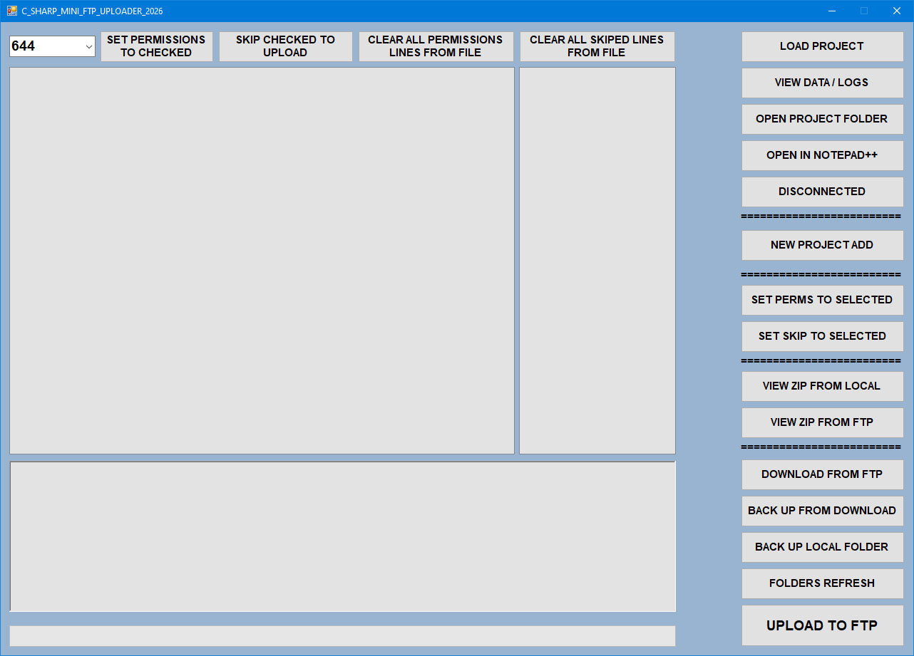
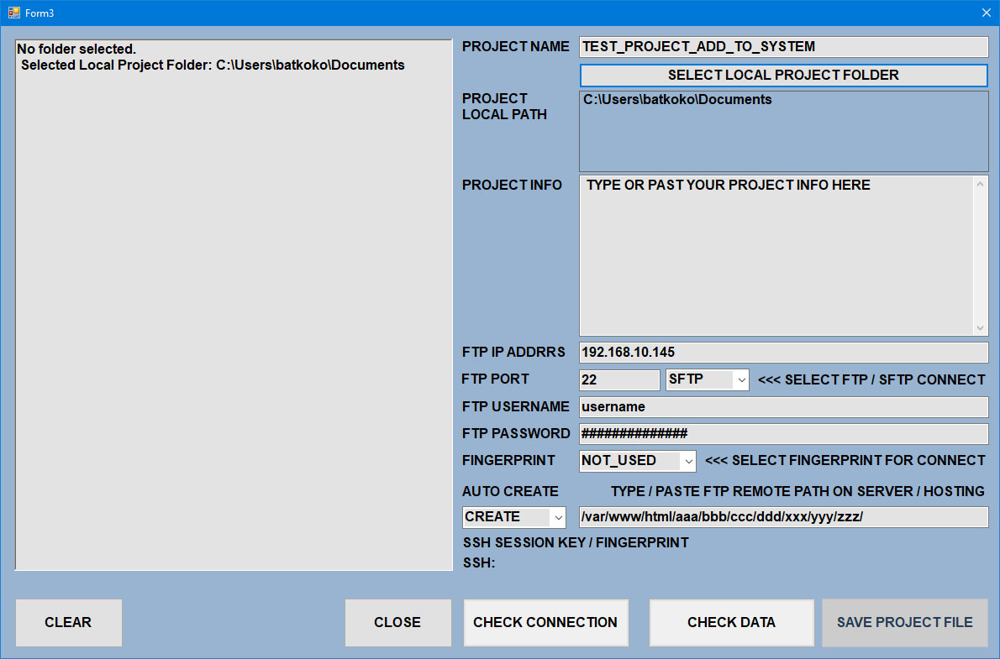
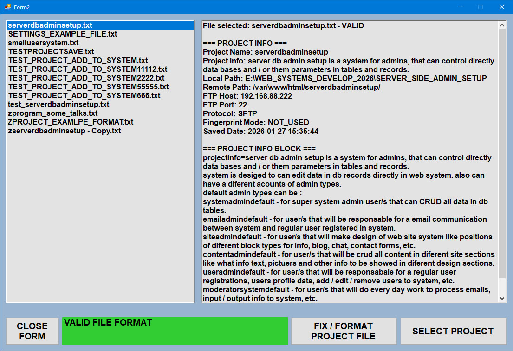
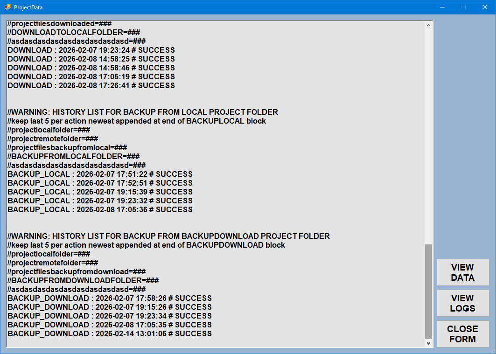
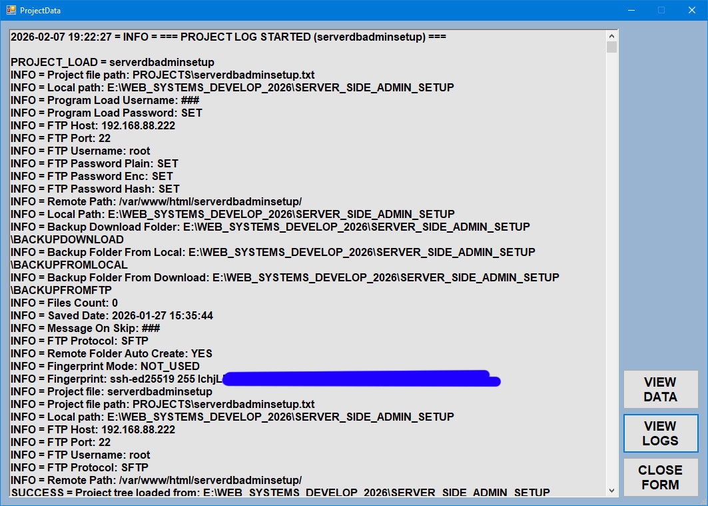
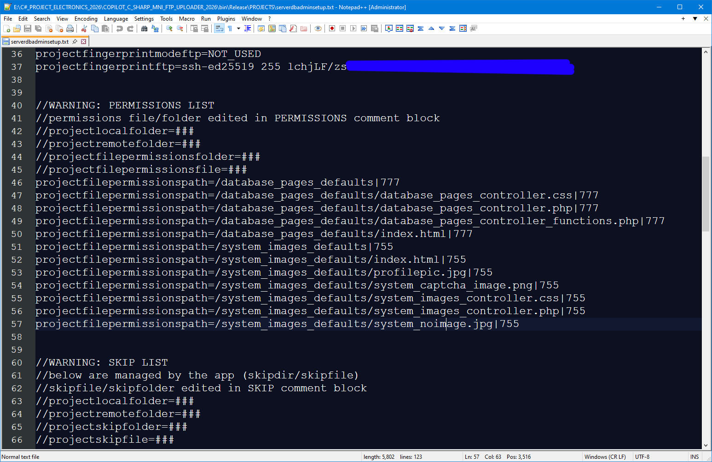
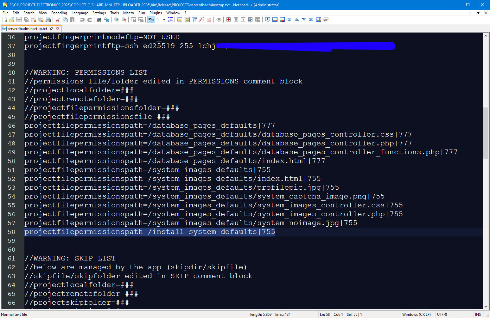
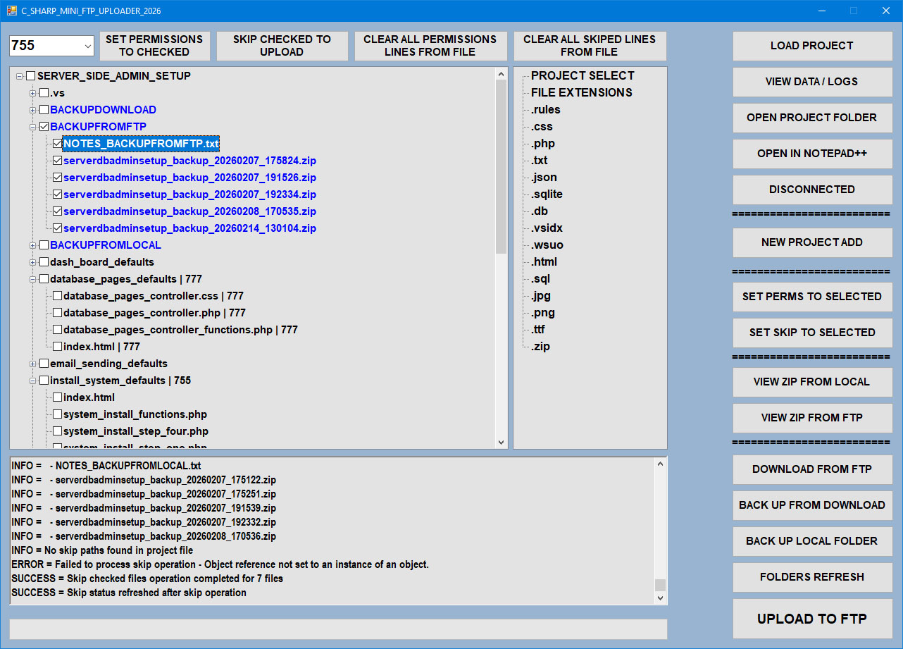
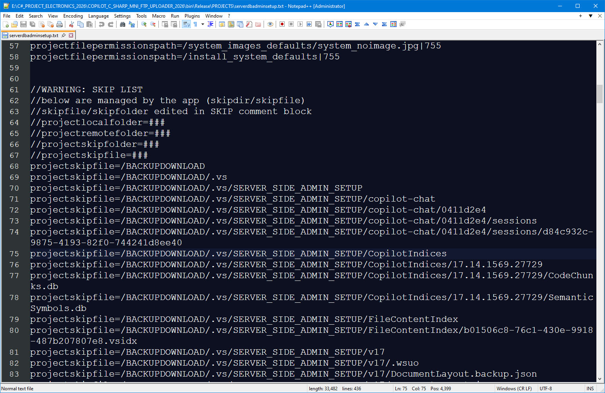

# C_SHARP_MINI_FTP_UPLOADER_2026

## Purpose (What this program does)
C_SHARP_MINI_FTP_UPLOADER_2026 is a Windows desktop tool for managing FTP/SFTP file transfers.
It helps you keep a local project folder and a remote server folder synchronized, while tracking
permissions, skipped paths, and history in a single project file.

It is designed for:
- Web developers and admins who upload website files
- Users who need repeatable, logged FTP/SFTP operations
- Teams that want consistent permissions and clean remote folders

## Big Picture (Global Functionality)
- Load a project file that contains connection data, local/remote paths, and rules.
- The local folder is the source of truth.
- The app can:
  - Upload missing files/folders to the server
  - Remove extra remote files (unless skipped)
  - Apply default or project-defined permissions
  - Keep a global log (on screen and in file)
  - Create and review backups (local and from FTP)

## Install (SFX Extractor)
This program uses a simple self-extracting installer (SFX).
1) Download the installer EXE.
2) Run it and choose a folder.
3) The app extracts to that folder and creates a desktop shortcut.

Notes:
- The program runs from any folder (not Program Files).
- Program data and logs are stored inside the install folder.

## Updates
- Download the newest installer and extract over the old folder, or to a new folder.
- If you extract to a new folder, remove the old one.

## Folder Structure (Inside the install folder)
- C_SHARP_MINI_FTP_UPLOADER_2026.exe
- PROGRAM_HELP_AND_HOW_TO\ (offline help site)
- PROGRAM_SETTINGS\ (program and user settings files)
- PROJECTS\ (project files)
- PROJECTSLOGS\ (log files for each project)

## Password Storage and Connection
The project file keeps three password values: plain, encrypted, and hash.
The plain password is kept for compatibility, but it is never printed in logs or UI.
The program writes the encrypted and hash values automatically when a new project is saved.

When connecting, the program tries the encrypted password first.
If that fails, it falls back to the plain password.
The hash is only valid if your server expects a hashed password; otherwise it is used
only to verify that the stored values match and were not corrupted.

## Core Workflow (Typical use)
1) Load Project file
2) Check connection
3) Folders Refresh (sync remote with local)
4) Upload checked files/folders if needed
5) Back up local or FTP data
6) Review logs

## Buttons & Forms (What they do)

### Project Management
- **NEW PROJECT ADD**: Create a new project file with FTP/SFTP settings and paths.
- **LOAD PROJECT**: Load a saved project file and populate the tree + rules.
- **REFRESH LOADED PROJECT**: Re-read the project file and rebuild the tree, permissions, skip status, and extensions list.
- **VIEW PROJECT DATA**: Show all project file data in a viewer form.
- **OPEN PROJECT FOLDER**: Open the local project folder in Explorer.
- **OPEN IN NOTEPAD++**: Open the project file in Notepad++.

### Connection
- **CONNECT / DISCONNECT**: Establish or close FTP/SFTP session.
- **CHECK CONNECTION** (new project form): Validate connection details before saving.

### File Operations
- **FOLDERS REFRESH**: Synchronize remote with local.
  - Reads project file each time.
  - Uploads missing files/folders.
  - Deletes extra remote items (not in local, unless skipped).
  - Applies permissions (project-defined or defaults: folders 755, files 644).
- **UPLOAD TO FTP**: Upload checked nodes and apply permissions.
- **UPLOAD BY EXTENSION**: If no nodes are checked, select an extension in the extensions tree and Upload will process all files with that extension across the project.
- **DOWNLOAD FROM FTP**: Download all remote files to BACKUPDOWNLOAD (overwrite mode).

### Permissions & Skip Rules
- **SET PERMISSIONS TO CHECKED**: Apply selected permission to checked nodes.
- **SET SKIP TO SELECTED**: Add checked nodes to skip list.
- **CLEAR ALL PERMISSIONS LINES FROM FILE**: Remove all permission rules in the project file.
- **CLEAR ALL SKIPPED LINES FROM FILE**: Remove all skip rules in the project file.

### Backups
- **BACK UP LOCAL FOLDER**: Create zip of local project folder.
- **BACK UP FROM DOWNLOAD**: Zip the BACKUPDOWNLOAD folder.
- **BACK UP FROM FTP**: Zip data downloaded from FTP.
- **VIEW ZIP FROM LOCAL / FTP**: Show available backups and notes.

## Logging (Global Log System)
- All actions write to a global log (RichTextBox) and to a project log file.
- Logs include timestamps, action category, and per-file details.
- Log history is kept in PROJECTSLOGS.

## Progress Display
- The progress bar shows activity, and the file counter at the bottom-right (label4) shows processed totals (example: UPLOAD 12/64).
- The old dynamic progress text label is hidden to keep the UI clean.

## Screenshots (optional)
(You can add or remove images below as needed.)

## Support
If you need help, open the offline help site:
PROGRAM_HELP_AND_HOW_TO\index.html

